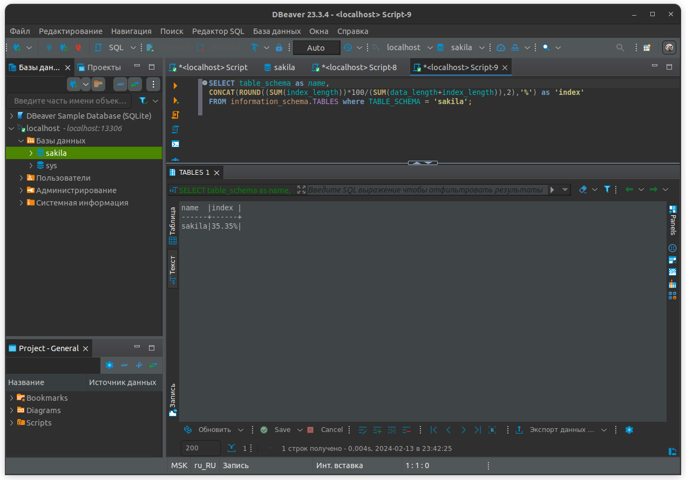
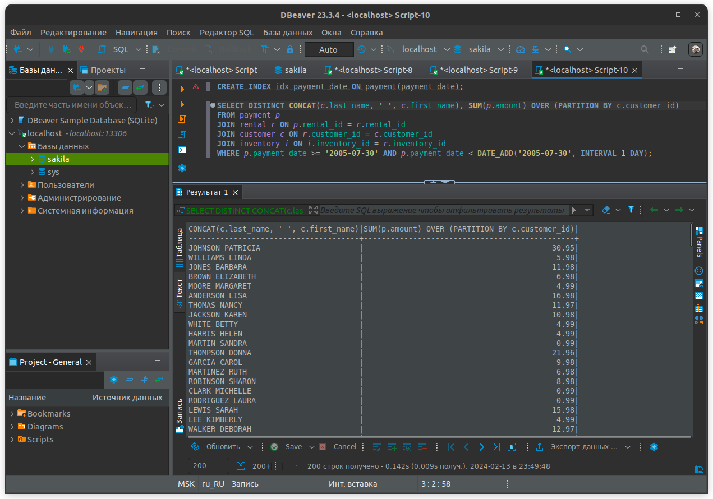

# Домашнее задание к занятию «Индексы» - Савельев Алексей SYS-25


Желаем успехов в выполнении домашнего задания.

### Задание 1

Напишите запрос к учебной базе данных, который вернёт процентное отношение общего размера всех индексов к общему размеру всех таблиц.

---

### Ответ 1

```sql
SELECT table_schema as name, 
CONCAT(ROUND((SUM(index_length))*100/(SUM(data_length+index_length)),2),'%') as 'index'
FROM information_schema.TABLES where TABLE_SCHEMA = 'sakila';
```

---
### Задание 2

Выполните explain analyze следующего запроса:
```sql
select distinct concat(c.last_name, ' ', c.first_name), sum(p.amount) over (partition by c.customer_id, f.title)
from payment p, rental r, customer c, inventory i, film f
where date(p.payment_date) = '2005-07-30' and p.payment_date = r.rental_date and r.customer_id = c.customer_id and i.inventory_id = r.inventory_id
```
- перечислите узкие места;
- оптимизируйте запрос: внесите корректировки по использованию операторов, при необходимости добавьте индексы.

---

### Ответ 2
- Для чтобы оптимизировать запрос и сделать его более читаемым необходимо использовать соединение JOIN, вместо FROM.
Необходимо создать индекс. Это также ускорит обработку.

```sql
CREATE INDEX idx_payment_date ON payment(payment_date);

SELECT DISTINCT CONCAT(c.last_name, ' ', c.first_name), SUM(p.amount) OVER (PARTITION BY c.customer_id)
FROM payment p 
JOIN rental r ON p.rental_id = r.rental_id 
JOIN customer c ON r.customer_id = c.customer_id 
JOIN inventory i ON i.inventory_id = r.inventory_id
WHERE p.payment_date >= '2005-07-30' AND p.payment_date < DATE_ADD('2005-07-30', INTERVAL 1 DAY);
```
